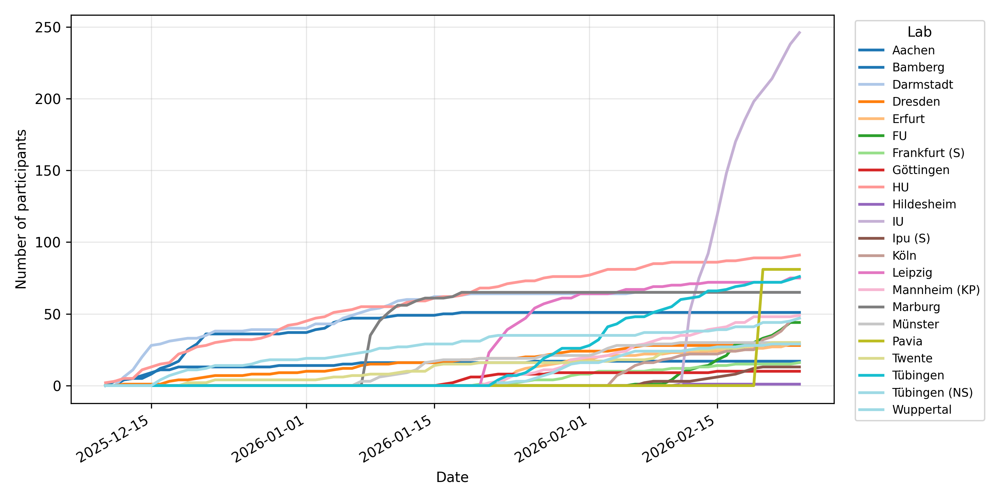
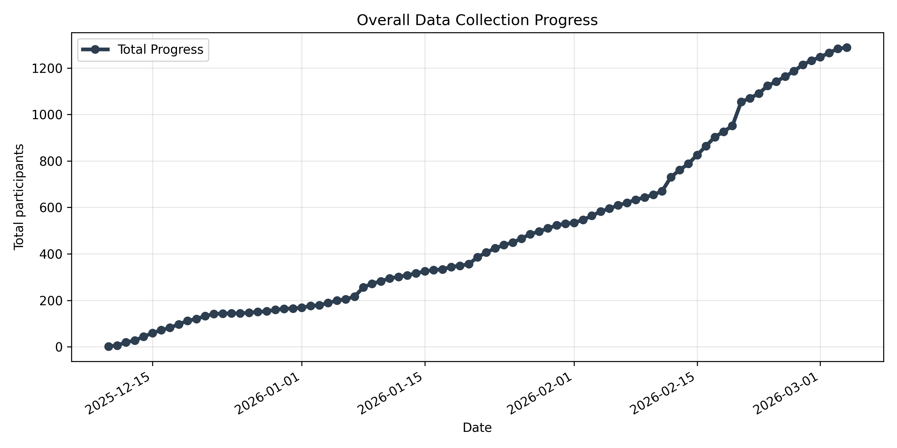

# German Lexicon Multilab Monitoring

This repository monitors the number of datasets collected across all participating labs in the German Lexicon Project. Data are tracked by reading directory listings on the HU Berlin server.

## Automated output

The following output is updated automatically every 10 minutes using GitHub Actions.

<!-- START_DEMO_TABLE -->

### Overall progress

**Total data files saved across all labs:** 897

**Overall progress (Target: 1440 participants):**

[███████████████████░░░░░░░░░░░] 897 / 1440 (62.3%)

### Table: Progress per lab

| Lab | *n* (Participants) | Last update (day) |
|-----|----------------------|-------------------|
| IU | 166 | 2026-02-17 |
| HU | 87 | 2026-02-16 |
| Leipzig | 72 | 2026-02-14 |
| Tübingen | 69 | 2026-02-17 |
| Darmstadt | 65 | 2026-02-06 |
| Marburg | 65 | 2026-01-18 |
| Aachen | 51 | 2026-01-18 |
| Mannheim Kognitive Psychologie | 44 | 2026-02-17 |
| Wuppertal | 41 | 2026-02-17 |
| Münster | 30 | 2026-02-11 |
| Dresden | 28 | 2026-02-07 |
| FU | 27 | 2026-02-17 |
| Tübingen Not Sona | 27 | 2026-02-15 |
| Twente | 26 | 2026-02-15 |
| Erfurt | 24 | 2026-02-14 |
| Köln | 24 | 2026-02-16 |
| Bamberg | 17 | 2026-01-26 |
| Frankfurt Sona | 15 | 2026-02-17 |
| Göttingen | 10 | 2026-02-15 |
| Ipu Sona | 8 | 2026-02-17 |
| Hildesheim | 1 | 2026-02-11 |
| Frankfurt Prolific | 0 |  |
| IPN | 0 |  |
| Ipu Prolific | 0 |  |
| Lüneburg | 0 |  |
| Pavia | 0 |  |
| Potsdam | 0 |  |

### Plot: Progress per lab over time

### Plot: Overall progress over time

<!-- END_DEMO_TABLE -->

