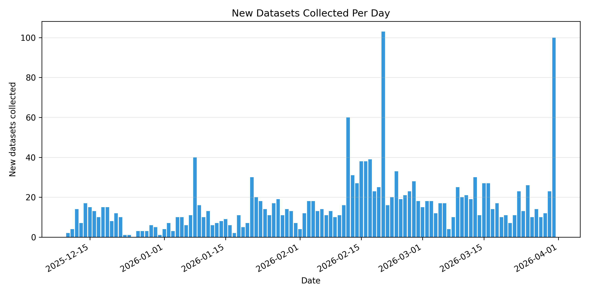

# German Lexicon Multilab Monitoring

This repository monitors the number of datasets collected across all participating labs in the German Lexicon Project. Data are tracked by reading directory listings on the HU Berlin server.

## Automated output

The following output is updated automatically every 10 minutes using GitHub Actions.

<!-- START_DEMO_TABLE -->

### Overall progress

**Total data files saved across all labs:** 2245

**Overall progress (Target: 2453 participants):**

[███████████████████████████░░░] 2245 / 2453 (91.5%)

### Table: Progress per lab

| Lab | *n* (Participants) | Last update (day) |
|-----|----------------------|-------------------|
| IU | 485 | 2026-04-19 |
| Frankfurt Prolific | 209 | 2026-04-14 |
| HU | 139 | 2026-04-20 |
| Hagen | 119 | 2026-04-13 |
| FU | 118 | 2026-04-20 |
| Köln | 112 | 2026-03-15 |
| Mannheim Kognitive Psychologie | 84 | 2026-04-19 |
| Pavia | 81 | 2026-02-20 |
| Tübingen | 80 | 2026-03-04 |
| Leipzig | 76 | 2026-03-04 |
| Wuppertal | 72 | 2026-04-20 |
| Aachen | 71 | 2026-04-19 |
| Erfurt | 69 | 2026-04-15 |
| Darmstadt | 65 | 2026-02-06 |
| Marburg | 65 | 2026-01-18 |
| Hildesheim | 56 | 2026-04-20 |
| Twente | 43 | 2026-04-14 |
| Münster | 36 | 2026-04-20 |
| Potsdam Sona | 36 | 2026-04-19 |
| Dresden | 34 | 2026-04-14 |
| Trier | 34 | 2026-04-20 |
| Tübingen Not Sona | 29 | 2026-02-21 |
| Frankfurt Sona | 24 | 2026-04-06 |
| ULM | 23 | 2026-04-20 |
| IPN | 21 | 2026-04-20 |
| Ipu Sona | 21 | 2026-04-17 |
| Bamberg | 17 | 2026-01-26 |
| Göttingen | 14 | 2026-03-17 |
| Graz | 5 | 2026-04-20 |
| LMU | 4 | 2026-04-20 |
| Bielefeld | 2 | 2026-04-20 |
| Potsdam Sona Cogscience | 1 | 2026-03-28 |
| Bochum | 0 |  |
| Bochum Prolific | 0 |  |
| Ipu Prolific | 0 |  |
| Lüneburg | 0 |  |
| Passau | 0 |  |
| Potsdam | 0 |  |
| Zurich | 0 |  |

### Plot: Progress per lab over time

### Plot: Overall progress over time

### Plot: New datasets collected per day

### Table: Average new datasets per day (rolling windows)

| Window | Start | End |  M(data/day) | Rank_1 | n_1 | Rank_2 | n_2 | Rank_3 | n_3 | Rank_4 | n_4 | Rank_5 | n_5 | n_Rest |
|--------|-------|-----|----------------------|---|----|---|----|---|----|---|----|---|----|--------|
| Since today 00:00 | 2026-04-21 | 2026-04-21 | 0.00 |  |  |  |  |  |  |  |  |  |  | 0 |
| Last 3 days | 2026-04-18 | 2026-04-20 | 16.00 | FU | 9 | IU | 5 | ULM | 5 | IPN | 4 | LMU | 4 | 21 |
| Last 7 days | 2026-04-14 | 2026-04-20 | 37.57 | Frankfurt Prolific | 119 | IPN | 21 | Aachen | 17 | FU | 17 | IU | 15 | 74 |
| Last 14 days | 2026-04-07 | 2026-04-20 | 26.14 | Frankfurt Prolific | 119 | IU | 37 | FU | 31 | Hildesheim | 31 | IPN | 21 | 127 |
| Last 30 days | 2026-03-22 | 2026-04-20 | 22.10 | Frankfurt Prolific | 209 | IU | 83 | FU | 46 | Hagen | 46 | Hildesheim | 41 | 238 |

<!-- END_DEMO_TABLE -->

