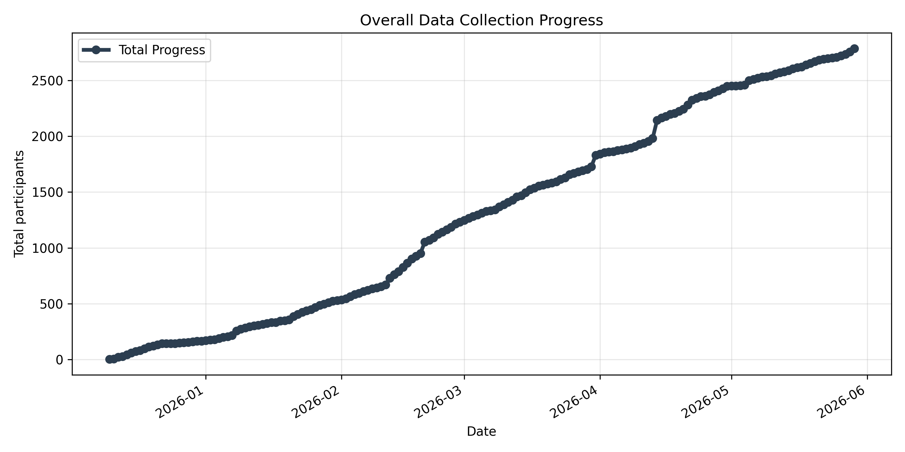
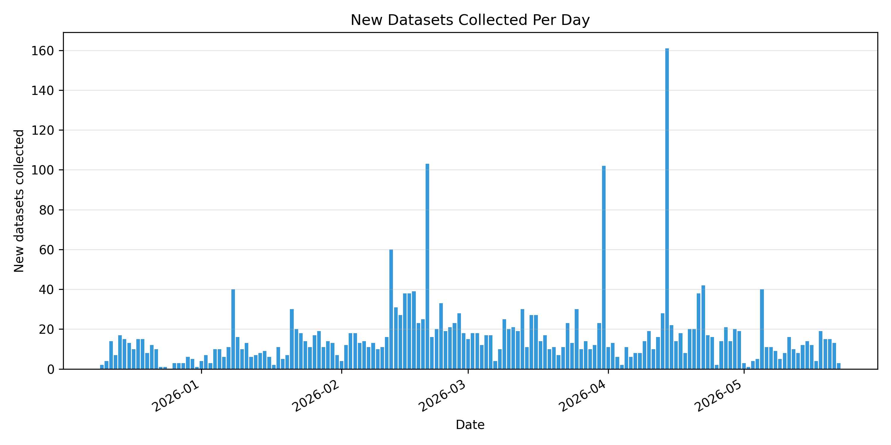

# German Lexicon Multilab Monitoring

This repository monitors data collection progress across all participating labs in the [German Lexicon Project](https://github.com/petrenca/German_Lexicon_Project). Dataset counts are derived from directory listings on the HU Berlin server, and data collection runs through **May 31, 2026**.

## Automated output

The following output is updated automatically every 10 minutes using GitHub Actions.

<!-- START_DEMO_TABLE -->

### Overall progress

**Total data files saved across all labs:** 2799

**Overall progress (Target: 2453 participants):**

[██████████████████████████████] 2799 / 2453 (100.0%)

### Table: Progress per lab

| Lab | *n* (Participants) | Last update (day) |
|-----|----------------------|-------------------|
| IU | 516 | 2026-04-29 |
| Frankfurt Prolific | 209 | 2026-04-14 |
| FU | 154 | 2026-05-15 |
| HU | 151 | 2026-05-29 |
| Hagen | 119 | 2026-04-13 |
| Köln | 112 | 2026-03-15 |
| Mannheim Kognitive Psychologie | 94 | 2026-05-15 |
| Erfurt | 88 | 2026-05-29 |
| Zurich | 82 | 2026-05-30 |
| Pavia | 81 | 2026-02-20 |
| Leipzig | 80 | 2026-05-12 |
| Tübingen | 80 | 2026-03-04 |
| Wuppertal | 77 | 2026-04-28 |
| Aachen | 71 | 2026-04-19 |
| Darmstadt | 65 | 2026-02-06 |
| Marburg | 65 | 2026-01-18 |
| Hildesheim | 63 | 2026-05-06 |
| ULM | 55 | 2026-05-26 |
| LMU | 54 | 2026-05-30 |
| Münster | 52 | 2026-05-19 |
| Trier | 52 | 2026-04-27 |
| Twente | 47 | 2026-05-07 |
| Graz | 45 | 2026-05-29 |
| Potsdam Sona | 42 | 2026-04-29 |
| Dresden | 36 | 2026-05-21 |
| Lüneburg Credit | 34 | 2026-05-30 |
| IPN | 32 | 2026-05-18 |
| Ipu Sona | 32 | 2026-05-26 |
| Frankfurt Sona | 31 | 2026-05-27 |
| Potsdam Sona Cogscience | 31 | 2026-05-28 |
| Tübingen Not Sona | 29 | 2026-02-21 |
| Lüneburg Paid | 26 | 2026-05-30 |
| Bochum Prolific | 23 | 2026-05-05 |
| Potsdam | 20 | 2026-04-22 |
| Bamberg | 17 | 2026-01-26 |
| Göttingen | 17 | 2026-05-08 |
| Bochum | 11 | 2026-05-25 |
| Bielefeld | 6 | 2026-04-27 |
| Ipu Prolific | 0 |  |
| Passau | 0 |  |

### Plot: Overall progress over time

### Plot: New datasets collected per day

### Table: Average new datasets per day (rolling windows)

| Window | Start | End |  M(data/day) | Rank_1 | n_1 | Rank_2 | n_2 | Rank_3 | n_3 | Rank_4 | n_4 | Rank_5 | n_5 | n_Rest |
|--------|-------|-----|----------------------|---|----|---|----|---|----|---|----|---|----|--------|
| Since today 00:00 | 2026-05-30 | 2026-05-30 | 7.00 | LMU | 2 | Lüneburg Paid | 2 | Zurich | 2 | Lüneburg Credit | 1 |  |  | 0 |
| Last 3 days | 2026-05-27 | 2026-05-29 | 23.67 | Zurich | 27 | LMU | 17 | Lüneburg Credit | 10 | Lüneburg Paid | 8 | HU | 3 | 6 |
| Last 7 days | 2026-05-23 | 2026-05-29 | 14.29 | Zurich | 32 | LMU | 23 | Lüneburg Credit | 14 | Lüneburg Paid | 10 | Potsdam Sona Cogscience | 5 | 16 |
| Last 14 days | 2026-05-16 | 2026-05-29 | 13.36 | Zurich | 53 | Lüneburg Credit | 32 | LMU | 23 | Lüneburg Paid | 23 | Graz | 17 | 39 |
| Last 30 days | 2026-04-30 | 2026-05-29 | 12.10 | Zurich | 80 | Graz | 38 | LMU | 36 | Lüneburg Credit | 33 | Lüneburg Paid | 24 | 152 |

<!-- END_DEMO_TABLE -->

